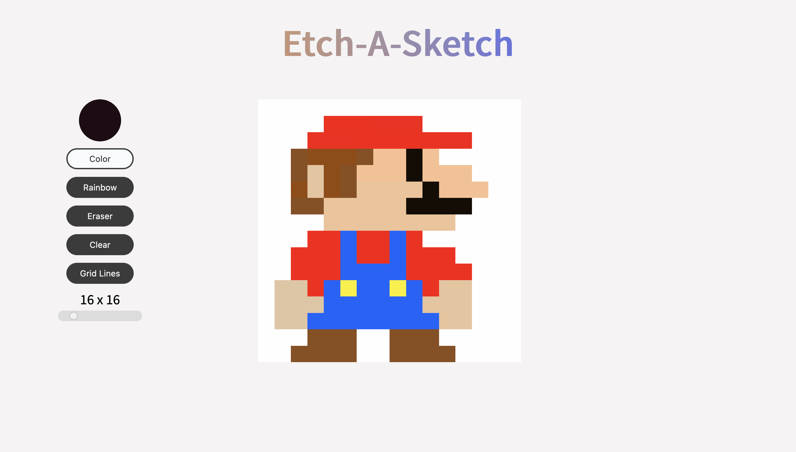

# Etch-A-Sketch

## Overview

This project was meant to test my DOM manipulation skills. I was instructed to create an Etch-A-Sketch web application, with the condition that the sketch pad be created using only JavaScript.

Users should be able to:

- Change the color of the grid cells by click or dragging in the sketch pad.
- Pick different colors to draw with.
- Add grid lines for precise drawing.
- Change the size of the grid

### Screenshot

### What I learned

I spent most of my development time learning about the different types of event listeners, and event delegation. After many hours on Stack Overflow and MDN docs, I was finally able to get the drawing function to work the way I intended. I thought using Flexbox would be best for getting the grid cells to line up properly on the sketch pad, but I wasn't quite satisfied with the results so I decided to learn how to use CSS grid. 

### Links

- Live preview: https://dasmith963.github.io/etch-a-sketch/

